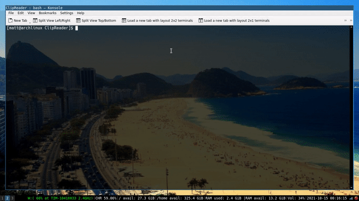

# ClipReader

A CLI utility which fetches the clipboard data, specifically from:
- Primary: The "middle mouse clipboard";
- Clipboard: The "Ctrl+C clipboard";

Clipreader aims to access the content of these two clipboards on X11 and return the data to the user in a CLI output environment.

## To compile
### gcc clipreader.c -o clipreader -lX11

## To run
### ./clipreader

----------
## References
https://www.uninformativ.de/blog/postings/2017-04-02/0/POSTING-en.html
